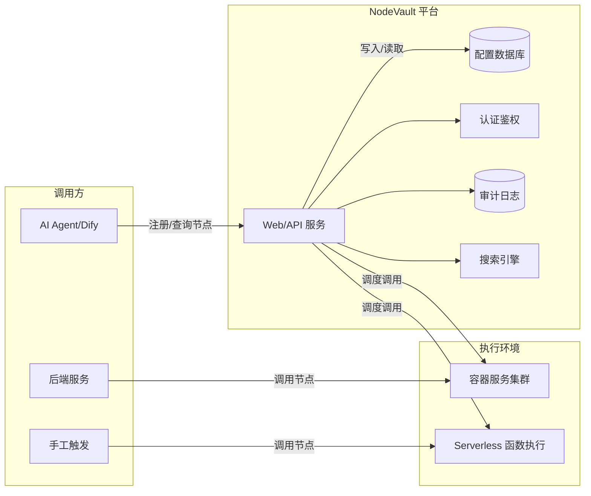
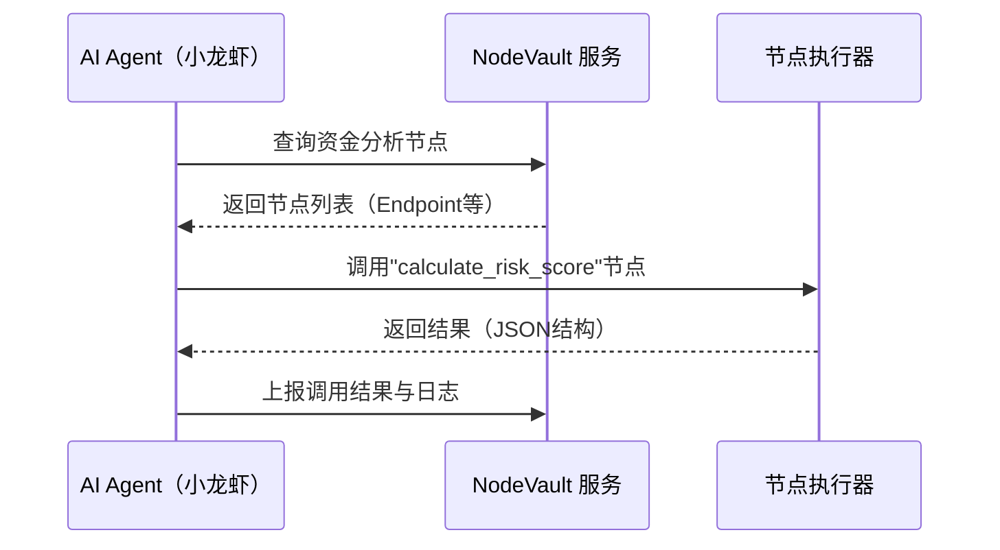
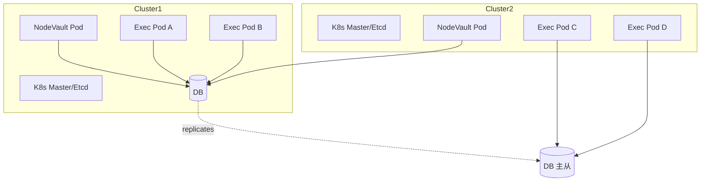
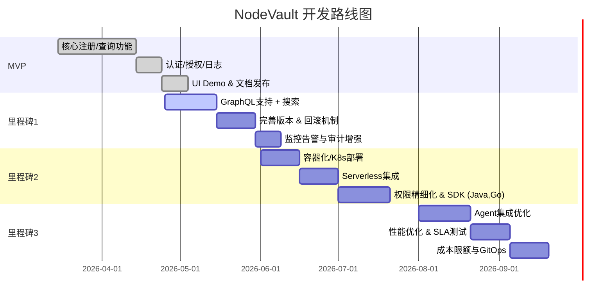

# 执行概要

**NodeVault**旨在打造企业级的**AI能力注册中心/市场**，类似于“AI能力资产池”。它将不同业务中可复用的AI处理模块（如数据清洗、资金分析、风险评估等）抽象为**节点（Node）**，统一注册管理，并对外提供标准化调用接口，实现能力的统一发现与调用。通过这种方式，可避免各项目重复造轮子，实现跨部门的AI能力复用与沉淀【15†L63-L72】【16†L72-L80】。NodeVault的设计需满足模块化、分层化、可扩展与可维护性原则，与AWS提到的企业级AI平台设计原则高度吻合，包括：**模块化分层**、**多模型兼容**、**统一编排**、**统一管理**（计费、权限、版本）等【15†L104-L113】【16†L72-L80】。

报告中提出了两套主要架构选型：一是**轻量注册中心 + 外部执行平台**，另一种是**内置执行平台**；以及两种执行环境：**容器化微服务** vs **无服务器（Serverless）**，并分别给出对比分析表（见下文表1、表2）。此外，我们给出完整的节点元数据模型设计、REST/GraphQL接口示例、SDK与Agent集成方案，并提供实施路线图和MVP功能清单。报告采用面向工程的严谨分析风格，配合Mermaid流程图和架构图，力求清晰、可操作。最后给出针对不同团队规模（3人、8人、20人）的开发成本和时间估算，以及关键风险与缓解措施建议。**结论性建议**：实施NodeVault可极大提升企业AI能力复用水平，前期先做最小可行产品（注册中心+基础检索），后续逐步扩展执行引擎和多语言SDK，确保架构可演进而非重造轮子。

## 1. 项目定位与能力层次

NodeVault应定位为企业AI平台的**“能力层”**。它类似于AWS提出的“AI能力操作系统”，负责**整合与管理AI基础能力**【15†L63-L72】【16†L72-L80】。具体而言，NodeVault主要聚焦于AI能力层（见图示），提供：  
- **节点能力注册与发现**：提供接口让开发者或自动化Agent注册新的能力节点，并让其他系统查询、发现这些能力。类似SkillRegistry和LangChain中的工具注册机制【9†L129-L138】【37†L58-L66】。  
- **能力元数据管理**：为每个节点维护输入/输出Schema、执行入口、版本、标签等元信息，实现结构化描述与管理。参照OpenAI的函数调用定义方式，节点可视为带有JSON Schema定义的**函数/工具**【35†L623-L632】【37†L58-L66】。  
- **版本与兼容管理**：记录节点的版本（如SemVer），支持回滚与多版本共存，避免上游改动导致下游中断。如SkillRegistry所示，每个技能都有明确版本，可回退到已知正常版本【9†L158-L167】。  
- **统一安全和治理**：提供认证鉴权、权限管理、多租户隔离、审计日志等企业级治理能力，符合AWS所倡导的“统一管理权限和模型”【15†L104-L113】【16†L72-L80】。

这些能力使NodeVault成为AI微服务架构中的“注册/发现中心”与“能力市场”。业务工作流（如AI Agent或应用编排引擎）调用NodeVault获得所需能力的调用信息，从而以**插件化**方式构建复杂AI应用。例如，Dify、LangChain或自研Agent可以直接调用NodeVault注册的能力节点，实现数据处理流程的自动化串联【35†L623-L632】【37†L58-L66】。

## 2. 关键属性与接口设计

### 2.1 节点定义（输入/输出 Schema、类型、执行方式）

- **名称 (name)**：唯一标识节点功能的字符串，如`clean_transaction_data`。  
- **版本 (version)**：语义化版本号（如`v1.2.0`），配合修改日志与回滚。  
- **描述 (description)**：功能简述。  
- **类型 (type)**：节点类别，可枚举（如`data_cleaning`、`analysis`、`tool`等），便于分类与过滤。  
- **输入模式 (input_schema)**：定义输入参数的JSON Schema或OpenAPI Schema（可指定字段名、类型、必填与否等）。  
- **输出模式 (output_schema)**：定义输出数据的JSON Schema。  
- **调用地址 (endpoint)**：节点的可调用地址或入口。可选多种执行方式：  
  - **HTTP 服务**：例如微服务地址`http://host/api/clean`。  
  - **Serverless 函数**：如AWS Lambda ARN或内部Function URL。  
  - **Docker容器**：指定镜像和运行命令（可在NodeVault调度下运行）。  
  - **直接代码**：极简模式，可内置脚本或函数（仅限低复杂度场景，不建议企业级使用）。  

- **标签 (tags)**：关键词数组，如`["finance","risk"]`，便于搜索与推荐。  
- **元数据 (metadata)**：作者、团队、创建时间、使用量、评分、许可证等。  
- **依赖关系 (dependencies)**：如该节点调用其他节点或服务，可列出依赖节点的ID与版本。

> **示例**：一个资金池检测节点的YAML元数据模板示例如下：  
```yaml
name: detect_fund_pool
version: "1.0.0"
description: 基于交易数据的资金池检测
type: analysis
input_schema:
  type: object
  properties:
    transactions:
      type: array
      description: 交易记录数组
  required: [transactions]
output_schema:
  type: object
  properties:
    suspicious_accounts:
      type: array
      items: {type: string}
description: 检测交易数据中的可能资金池账户列表
endpoint: http://ai-service.internal/fund_pool_detect
tags: ["finance","risk","analytics"]
team: "RiskTeam"
```

### 2.2 注册/发现 API （REST/GraphQL示例）

#### RESTful 接口设计

- **注册节点**：`POST /api/nodes` ，请求体包含节点的元数据信息（JSON），返回新增节点ID及详情。  
- **更新节点**：`PUT /api/nodes/{id}`，可用于修改节点定义或发布新版本。  
- **查询节点列表**：`GET /api/nodes?name=&tags=&type=&version=...`，支持按名称、标签、类型等过滤；返回节点摘要列表及分页信息。  
- **获取节点详情**：`GET /api/nodes/{id}`，返回完整元数据和调用信息。  
- **删除节点**：`DELETE /api/nodes/{id}`（需严格权限管理，慎用，可实现软删除）。

> **示例请求**：注册节点  
> ```http
> POST /api/nodes HTTP/1.1
> Content-Type: application/json
>
> {
>   "name": "calculate_risk_score",
>   "version": "1.0.0",
>   "description": "计算客户风险评分",
>   "type": "analytics",
>   "input_schema": { ...JSON Schema... },
>   "output_schema": { ...JSON Schema... },
>   "endpoint": "https://ml-service/internal/risk",
>   "tags": ["finance","risk"],
>   "team": "RiskTeam"
> }
> ```  
> **示例响应**：  
> ```json
> {
>   "id": "node-123",
>   "name": "calculate_risk_score",
>   "version": "1.0.0",
>   "status": "CREATED",
>   "created_at": "2026-03-10T12:34:56Z"
> }
> ```

#### GraphQL 接口设计

- **Schema**：定义`Node`类型及相关查询/变更。  
```graphql
type Node {
  id: ID!
  name: String!
  version: String!
  description: String
  type: String
  inputSchema: JSON
  outputSchema: JSON
  endpoint: String
  tags: [String]
  team: String
}
type Query {
  nodes(filter: NodeFilter): [Node!]!
  node(id: ID!): Node
}
input NodeFilter {
  name: String
  tags: [String]
  type: String
}
type Mutation {
  createNode(input: CreateNodeInput!): Node
  updateNode(id: ID!, input: UpdateNodeInput!): Node
}
input CreateNodeInput {
  name: String!
  version: String!
  description: String
  type: String
  inputSchema: JSON
  outputSchema: JSON
  endpoint: String!
  tags: [String]
  team: String
}
input UpdateNodeInput {
  description: String
  version: String
  endpoint: String
  # ...可包含需要更新的字段
}
```  
> **示例GraphQL查询**：查找所有标记包含“finance”的节点  
> ```graphql
> query {
>   nodes(filter: { tags: ["finance"] }) {
>     id
>     name
>     version
>     endpoint
>   }
> }
> ```  
> **示例GraphQL返回**：  
> ```json
> {
>   "data": {
>     "nodes": [
>       {
>         "id": "node-101",
>         "name": "clean_transaction_data",
>         "version": "2.1.0",
>         "endpoint": "https://api.company.com/cleanData"
>       },
>       {
>         "id": "node-205",
>         "name": "calculate_risk_score",
>         "version": "1.0.0",
>         "endpoint": "https://ml.company.com/risk"
>       }
>     ]
>   }
> }
> ```

### 2.3 认证与权限

- **认证方式**：推荐使用标准OAuth2/OpenID Connect或者JWT身份认证【15†L104-L113】。所有接口需强制认证，避免公开泄露能力。  
- **权限控制**：引入RBAC或ABAC策略。节点可以与团队或应用关联，定义“谁可以注册、修改、调用”该节点。可参考API网关或Kubernetes Role机制，保护敏感数据节点。  
- **多租户隔离**：在企业环境中，不同业务线可拥有各自的命名空间/租户，互不干扰。默认禁止跨命名空间调用。  

### 2.4 版本管理与兼容策略

- **语义化版本**：建议使用语义化版本号（MAJOR.MINOR.PATCH）。新版本发布时，可通过接口上传并指定`is_default`、`is_deprecated`等标志，保证平滑过渡。  
- **回滚策略**：允许将某版本回退为默认或禁用版本。系统可自动在新版本出现错误时回滚到上一个稳定版本。SkillRegistry即强调每个Skill都可版本控制并回滚【9†L158-L167】。  
- **兼容策略**：如果可能，尽量设计向后兼容接口；对于重大改动，通过升级MAJOR版本来区分。NodeVault应提醒下游用户不同版本间的不兼容性。  

### 2.5 元数据字段与标签/搜索

我们推荐**元数据字段**如下表，其中关键字段用于搜索与过滤：  

| 字段           | 类型     | 示例                              | 说明                               |
|:-------------|:-------|:--------------------------------|:---------------------------------|
| id           | ID     | `node-123`                      | 全局唯一标识                        |
| name         | String | `calculate_risk_score`         | 节点名称                            |
| version      | String | `1.0.0`                        | 版本号                              |
| description  | String | `计算客户风险评分`              | 功能描述                            |
| type         | String | `analysis`                     | 节点类型（如“data_cleaning、analysis、tool”） |
| endpoint     | String | `https://api/.../risk`         | 调用地址或执行入口                    |
| input_schema | JSON   | `{...}`                        | 输入JSON Schema                      |
| output_schema| JSON   | `{...}`                        | 输出JSON Schema                      |
| tags         | [String] | `["finance","risk"]`           | 标签列表                            |
| team         | String | `RiskTeam`                     | 所属团队或部门                        |
| owner        | String | `alice@example.com`            | 负责人邮箱                           |
| created_at   | DateTime| `2026-03-01T10:00:00Z`        | 创建时间                            |
| updated_at   | DateTime| `2026-03-05T15:00:00Z`        | 最后更新时间                         |
| status       | String | `ACTIVE` / `DEPRECATED`       | 状态（启用/弃用）                    |

用户可以基于上述字段进行**模糊搜索或精确过滤**，例如按`name`关键字查找、按`tags`标签筛选等。推荐使用全文搜索引擎（如ElasticSearch、MeiliSearch）加速标签和描述搜索。标签应按照业务语义分类（金融、风控、图像识别、OCR 等），方便快速定位能力。

### 2.6 监控与审计

- **调用日志**：记录每次节点调用的请求参数、响应结果和耗时，用于后期审计和问题排查。可以将日志导入Elasticsearch/Grafana等用于监控。  
- **性能指标**：监控每个节点的TPS、平均延时、错误率等，定义SLA级别。例如**99%请求<500ms**等目标。  
- **使用统计**：统计每个节点的调用次数、使用者、团队分布。这有助于评估能力价值。可借鉴SkillRegistry的“Active Contributors/Downloads”统计【9†L147-L156】。  
- **报警与审计**：异常调用量或失败率超标时，自动触发告警。记录谁在何时进行注册/修改操作，满足合规要求。

### 2.7 回滚策略

- 对于**元数据更新**：支持事务式更新，更新失败时自动回退到原版本。  
- 对于**运行时异常**：若新版本节点在运行时出现未捕获异常，可自动切换到旧版本或降级方案（如调用备用节点）。  
- 支持**配置文件回滚**，如NodeVault自身配置或安全策略变更出错时，快速恢复已知可用版本。

### 2.8 依赖管理

- 如果节点A调用其他节点B（例如通过内部API或消息队列），应在A的元数据里声明`dependencies: ["node-B:1.2.0"]`。NodeVault可以检查依赖关系图，防止循环依赖或缺失依赖。  
- 对于复杂的**工作流依赖**，可以引入类似Kubernetes的ConfigMap或Job依赖关系管理，但建议将此逻辑留给上层编排系统（如Dify Workflow或Airflow），NodeVault重点关注单个节点。  

### 2.9 可观测性（Observability）

- **端到端追踪**：支持分布式追踪（如OpenTelemetry），在调用链路中注入TraceID，以便监控跨节点调用性能。  
- **健康检查**：可选为长连接或核心节点设置心跳检测（如Kubernetes健康探针），确保节点可用。  
- **指标打点**：为每个节点注册Prometheus指标（如`node_invocations_total`、`node_latency_seconds`等），用于Grafana监控。  

### 2.10 成本控制与SLA

- 每个节点可有**定价或配额**属性（如调用费用、速率限制）。NodeVault可与计费系统对接，对调用量计费或限制，并生成账单。  
- SLA目标：比如“99%调用在300ms以内”。系统需要监控并优化性能，避免单点过载。可参考Cloudflare的建议，将容器和无服务器架构的成本和扩展机制合并考虑【25†L114-L122】【31†L415-L423】。

## 3. 架构选型对比

我们提出两维度选型对比：**注册中心角色 vs 集成执行引擎**，以及**容器化微服务 vs Serverless**。下表比较了各方案的优缺点、适用场景、扩展性和运维成本。

### 3.1 方案对比：注册中心 vs 内置执行

| 特性                 | 轻量注册中心＋外部执行平台                                 | 内置执行平台                                          |
|--------------------|----------------------------------------------------|----------------------------------------------------|
| **定义**             | 只负责节点的元数据注册、查询和管理；节点实际执行在外部服务中（微服务或云函数）   | 除注册功能外，集成调度/执行引擎，直接执行或管理节点任务（含编排功能） |
| **优点**             | - 架构简单、职责单一<br>- 可复用现有服务/函数基础设施<br>- 支持多语言、多技术栈| - 统一平台，调用流程集中可监控<br>- 便于实现全局事务（如可串联多节点）<br>- 可内置智能调度和资源控制 |
| **缺点**             | - 需要额外集成外部执行逻辑<br>- 难以统一监控调用链<br>- 可能增加延时（网络调用） | - 平台复杂度高、开发成本大<br>- 扩展性受限（需自行扩展调度器）<br>- 单体风险（平台故障影响所有） |
| **适用场景**          | - 组织已有成熟微服务/函数平台<br>- 高度异构环境<br>- 强调模块解耦                   | - 需要集中编排复杂任务流<br>- 小到中型团队，希望“一站式”管理<br>- 需要统一安全审计 |
| **扩展性**           | 高：外部服务独立扩容，注册中心本身只处理元数据，伸缩简单            | 中：需要同时扩展执行引擎，复杂度大；但可为特定业务定制优化            |
| **运维成本**         | 较低：NodeVault只需维护数据库和API服务；执行层运维独立 | 较高：NodeVault自身承担更多运行时功能，需要运维数据库、编排模块和执行环境 |
| **参考示例**         | *SkillRegistry*采用轻量注册中心，执行隔离于外部容器【9†L129-L138】【9†L158-L167】<br>主流微服务架构倾向拆分关注点【25†L114-L122】 | 一些AI平台（如自研Agent平台）或工作流引擎将注册与执行集成，需要自建复杂调度<br>类似于Kubernetes加上自定义控制器模型 |

### 3.2 方案对比：容器化微服务 vs 无服务器 Serverless

| 特性               | 容器化微服务                            | 无服务器（Serverless）                       |
|------------------|------------------------------------|-----------------------------------------|
| **部署启动**        | 需要预先配置环境（镜像、依赖），初始化时间较长。部署后可快速启动并重用。         | 部署快速（只需上传代码或包），无需管理基础设施；启动延迟低（毫秒级）【31†L427-L435】。    |
| **扩展性**          | 可预设或自动扩容节点数量，适合长期稳定负载；缩放需额外调度逻辑。            | 自动扩展到零成本，响应突发流量能力强；按需自动调度，无需开发者管理扩缩【31†L405-L413】【25†L114-L122】。 |
| **成本**            | 通常持续运行，有固定资源开销；即使空闲也计费。<br>适合持续高负载场景。       | 按调用次数计费，无闲置成本【25†L114-L122】【31†L415-L423】。但在高并发场景可能成本增加。 |
| **维护**            | 开发者负责镜像构建、安全更新、集群管理。对环境控制力高。            | 服务商负责底层管理和安全补丁；开发者专注代码。测试较难（本地复现困难）【31†L435-L443】。 |
| **适用场景**        | 长时间运行任务或有状态服务；对启动时间敏感的服务；需要特定运行环境或GPU支持。  | 间歇性、触发型任务；请求量不稳定峰值大；需要快速开发和弹性伸缩；无状态服务。          |
| **运维成本**        | 较高：需管理集群（如K8s）、镜像仓库和监控系统。<br>依赖团队成熟度。      | 较低：省略底层运维，开发/测试成本投入多于运维（考量云厂商锁定）。         |
| **参考示例**        | 典型微服务与容器平台；许多企业AI系统会将核心服务容器化便于迁移和环境复制【31†L415-L423】。<br>适合稳定流量和高性能需求。 | Cloudflare Workers、AWS Lambda等FaaS；对于无持续流量的API，Serverless仅为实际调用付费【25†L114-L122】【31†L415-L423】。<br>某些AI平台（如函数型执行环境）常用此模式。 |

根据以上对比，可以制定混合架构。例如核心低延时、需长运行的节点用容器部署（保证兼容性和性能），而小型工具或偶尔触发的节点用Serverless实现（节省成本并快速扩容）。

### 3.3 系统组件关系图


*图中组件说明：NodeVault核心是Web/API服务，内部持久化存储节点元数据并提供搜索、鉴权与日志审计；执行环境可包括容器集群和Serverless函数。AI Agent、内部服务或用户应用通过NodeVault注册/发现节点，再触发外部执行环境。*

### 3.4 数据流/调用流程示意


*图示：AI Agent首先从NodeVault检索需要的能力节点，然后调用对应的执行服务，最后将结果回传并记录日志。*

## 4. 部署与扩展方案

- **容器化部署**：可采用Kubernetes集群部署NodeVault服务与执行环境。NodeVault服务可以做成微服务组件（API Server、后台任务、数据库、搜索引擎）。执行环境如有状态服务可用Deployment，无状态工具可用Knative等Serverless框架。  
- **Serverless部署**：若偏向FaaS架构，可将节点执行逻辑部署为无服务器函数（如AWS Lambda、Azure Function或Cloudflare Workers），NodeVault本身可托管在轻量容器或Serverless平台上。  
- **多活/容灾**：建议在多可用区部署NodeVault实例，并使用负载均衡（如Nginx或云LB）和数据库主从。关键数据（注册信息、版本）可使用分布式数据库（如CockroachDB、TiDB）保证高可用。  
- **扩展方案**：NodeVault核心只管理轻量数据，可按需横向扩展API实例。执行环境则根据节点数量独立伸缩。若采用Serverless，自动弹性可极大简化扩展；容器化时可结合K8s HPA。  


*部署拓扑示例：多活Cluster，NodeVault服务与执行服务部署在多个集群节点，数据库跨可用区同步保证数据一致。*  

## 5. CI/CD与测试策略

- **版本管理**：使用Git（或gitops）管理NodeVault代码和部署配置。节点元数据可导出为文件夹形式（如每个节点一个JSON/YAML），并纳入配置管理。  
- **自动化测试**：编写单元测试验证API逻辑，集成测试覆盖端到端流程（注册–查询–调用）。使用Mock服务模拟节点执行接口。可以使用Postman/Newman或自定义脚本执行API测试。  
- **CI/CD流水线**：采用Jenkins/GitHub Actions/GitLab CI等构建并部署NodeVault镜像。流水线步骤：代码检查→单元测试→构建镜像→发布到私有仓库→部署到测试环境→E2E测试→生产部署。每个节点的更新可触发相应的部署流水线（蓝绿发布或滚动更新）。  
- **Schema校验**：CI中集成Schema和元数据校验工具（JSON Schema Validator），提交时自动校验`input_schema`/`output_schema`的有效性。  
- **迭代和回滚**：使用持续集成时，任何版本发布都要有完整的回滚方案（如按版本号回滚DB记录，或者部署历史版本镜像）。

## 6. SDK设计与Agent集成

- **多语言支持**：提供OpenAPI/Swagger规范文档，自动生成多语言客户端SDK（如Python、Java、Go、TypeScript）。可利用OpenAPI Generator或GraphQL Codegen生成器。  
- **自动生成Client**：发布公开API文档，保证每个版本的API都有对应的SDK。维护SDK版本与NodeVault版本同步。  
- **Schema校验**：在客户端集成请求参数校验，根据Node定义的JSON Schema验证输入输出，提前捕获格式错误。  
- **Mock测试**：提供Mock服务或环境（如WireMock）模拟NodeVault和节点调用，方便离线测试Agent逻辑。  
- **与Agent整合**：  
  - **Dify**：可将NodeVault暴露的节点作为Dify的工具或子工作流。Dify Agent或Workflow节点可调用NodeVault API检索能力，然后使用“HTTP请求”或“自定义节点”触发这些能力。  
  - **LangChain**：将NodeVault的节点映射为LangChain的`Tool`接口（类似示例中的`Tool(name, func, description)`【37†L82-L90】），并在代理初始化时加载。如一个`CalculateRiskTool`调用NodeVault提供的REST endpoint。  
  - **小龙虾Agent**：通过其Tool管理机制，将NodeVault注册中心作为工具目录源，让小龙虾在会话前检索相关工具并注入。可以实现“自发现”：Agent解析用户意图后，自动调用NodeVault搜索相关节点并执行。  
- **示例**：LangChain Python示例，初始化包含NodeVault节点的Agent：  
  ```python
  from langchain.tools import Tool
  import requests

  def call_node(node_id, params):
      res = requests.post(f"https://nodevault/api/nodes/{node_id}/invoke", json=params)
      return res.json()
  risk_tool = Tool(
      name="CalculateRisk",
      func=lambda inputs: call_node("node-123", inputs),
      description="计算客户风险评分，输入交易数据输出风险得分"
  )
  # 将risk_tool添加到LangChain agent工具列表
  ```

## 7. 迁移与落地路线图

### 7.1 MVP功能清单

- **核心功能**：节点注册/查询、基础检索接口、用户认证、元数据管理。  
- **安全与版本**：基础鉴权/授权、简单版本控制、基本审计日志。  
- **调用演示**：提供最简Demo节点和调用示例。  
- **可视化**：简单Web UI或Portal，用于展示和测试已注册节点。  
- **SDK样例**：发布一个简单的Python SDK示例。  

**MVP目标**：验证核心概念，快速上线内部试用。

### 7.2 后续迭代里程碑

| 迭代 | 功能要点                                       | 工期（人日） | 依赖               |
|:----|:-------------------------------------------|:---------|:-----------------|
| **里程碑1**<br>(1–2个月) | - 增强API（GraphQL支持）<br>- 添加标签/搜索功能<br>- 完善版本管理（回滚、弃用）<br>- 日志监控集成（Prometheus） | 20      | MVP完成           |
| **里程碑2**<br>(2–4个月) | - 实现容器化部署&K8s运维<br>- 加入Serverless执行选项<br>- 多租户和权限精细化（RBAC）<br>- 发布多语言SDK (Java, Go) | 30      | 里程碑1完毕         |
| **里程碑3**<br>(4–6个月) | - 支持Agent工具发现（自动化推荐）<br>- 大规模性能优化与SLA测试<br>- 成本计量与限额管理<br>- 集成企业级CI/CD（GitOps）  | 25      | 里程碑2完毕         |

### 7.3 时间线 (Roadmap)



### 7.4 人力与成本估算

- **小型团队 (3人)**：建议敏捷迭代。MVP阶段约需45人日，中级阶段再投入约60人日，总计约3个月。采用开源组件（如Postgres、K8s、Swagger）以节省开发成本。  
- **中型团队 (8人)**：可并行开发模块。MVP约20人日，后续迭代约60–80人日，总约3–4个月。多人分工有助快速完成API、UI、SDK各部分。  
- **大型团队 (20人)**：具备测试、安全团队，可更细分工作流。总时间可压缩到2–3个月，但成本显著增加，需协调沟通成本。  

成本上，根据地区差异，一般按照**50万–150万人民币**预算（含人员工资、云资源、工具许可等）。以上仅为估算，具体应结合实际资源和业务优先级调整。

## 8. 关键风险与缓解措施

- **技术风险**：若NodeVault承担过多执行逻辑，平台可能复杂度过高。**缓解**：前期保持轻量注册中心定位，避免捆绑执行细节。逐步演进扩展执行能力。  
- **性能风险**：大量节点调用可能导致注册中心瓶颈。**缓解**：做好水平扩展设计，使用缓存（如Redis）降低数据库压力；执行直接点对点调用，尽量绕过主中心数据流。  
- **安全风险**：外部调用接口可能被滥用。**缓解**：严格认证授权和审计，使用成熟的OAuth框架；敏感节点可设IP/网络白名单和调用配额。  
- **兼容性风险**：节点定义协议不统一。**缓解**：制定清晰的Schema规范，严格版本管理。确保节点的输入输出契约稳定。  
- **采用风险**：业务团队可能对新系统接受度不高。**缓解**：早期展示快速成效，与关键项目合作试点，提供方便的SDK和文档，降低使用门槛【15†L63-L72】【37†L58-L66】。  

## 9. 参考资料（优先级）

- AWS “企业级AI 平台建设思路”【15†L63-L72】【15†L104-L113】  
- 腾讯云“企业级AI平台能力架构”【16†L72-L80】  
- Nacos 3.0 “AI Registry”架构设计【2†L189-L198】  
- SkillRegistry AI 市场文章【9†L129-L138】【9†L158-L167】  
- OpenAI 函数调用文档【35†L623-L632】【35†L681-L689】  
- LangChain工具指南【37†L58-L66】【37†L82-L90】  
- 云架构对比 Serverless vs 容器【31†L415-L423】【25†L114-L122】  
- 微服务与Serverless成本分析【25†L114-L122】【31†L415-L423】  

上述资料提供了设计NodeVault所需的技术参考和最佳实践——包括AI平台架构原则【15†L63-L72】、工具/技能市场示例【9†L129-L138】、函数调用机制【35†L623-L632】、以及微服务与Serverless的对比【25†L114-L122】【31†L415-L423】。  

**结论**：NodeVault聚焦于**AI能力复用与发现**，在整体AI平台中扮演类似“能力目录+服务总线”的角色【15†L63-L72】【16†L72-L80】。其设计要点是模块化、标准化、可扩展：**节点规格**应如OpenAPI/JSON Schema般清晰，【37†L58-L66】【35†L623-L632】；**架构**可先轻量逐步扩展，多渠道并行（容器与FaaS混合），结合以上方案表格进行权衡【25†L114-L122】【31†L415-L423】。建议从核心功能入手（MVP先完成功能注册、检索、安全与监控），再逐步迭代版本、SDK、自动化和性能优化，最终形成企业级AI“能力市场”，大幅提升研发效率和AI落地速度。